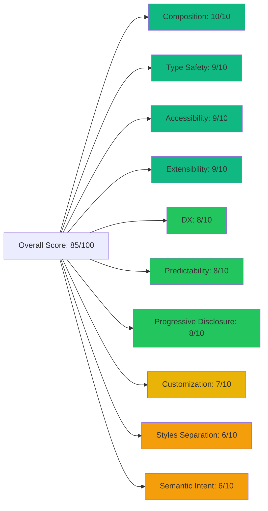

# HeroUI v3 Code Review Feedback

## Splento Platform v3 - Company Account Settings

**Review Date:** November 23, 2025  
**Reviewer:** Senior Frontend Developer  
**HeroUI Version:** v3.0.0-beta.2

---

## Executive Summary

Your codebase demonstrates **strong adoption** of HeroUI v3 patterns, particularly in the areas of compound components, composition, and type safety. The project structure is well-organized with clear separation between UI wrappers and domain-specific components.

### Overall Grade: **B+ (85/100)**

**Key Strengths:**

- ✅ Excellent use of compound components throughout the application
- ✅ Strong TypeScript implementation with proper type extensions
- ✅ Good separation of concerns between UI and business logic
- ✅ Consistent component patterns and naming conventions

**Areas for Improvement:**

- ⚠️ Button variants don't follow semantic naming (missing `primary`, `secondary`, `tertiary`)
- ⚠️ Some custom styling bypasses HeroUI's design token system
- ⚠️ Limited use of HeroUI's theming capabilities
- ⚠️ Manual focus blur workaround indicates potential architecture gaps

---

## Detailed Analysis by Principle

### 1. Semantic Intent Over Visual Style ⚠️ **Needs Improvement**

**Score: 6/10**

HeroUI v3 emphasizes semantic variants (`primary`, `secondary`, `tertiary`, `danger`) over visual descriptions. Your implementation shows mixed adherence to this principle.

#### ❌ Issues Found

**In [AccountSettings.tsx](file:///Users/eugene/Library/CloudStorage/GoogleDrive-info@semeykin.com/My%20Drive/Antigravity/Splento_Platform_v3/company-account-settings/src/app/admin/AccountSettings.tsx#L158-L161):**

```tsx
// ❌ Using 'ghost' variant instead of semantic variants
<Button variant="ghost" className="bg-gray-200 hover:bg-gray-300 text-foreground font-medium transition-colors">
    Discard
</Button>
<Button onPress={handleSave} className="font-medium shadow-sm bg-primary hover:opacity-90 text-white transition-opacity">
    Save
</Button>
```

**Problems:**

1. "Discard" button uses `variant="ghost"` but manually applies background colors, defeating the purpose of variants
2. "Save" button doesn't specify a variant at all, relying entirely on className overrides
3. No clear semantic hierarchy (primary/secondary/tertiary)

#### ✅ Recommended Approach

```tsx
// ✅ Using semantic variants according to HeroUI v3 principles
<Button variant="secondary" onPress={handleDiscard}>
    Discard
</Button>
<Button variant="primary" onPress={handleSave}>
    Save
</Button>
```

According to HeroUI v3 documentation:

| Variant | Purpose | Usage | Example in Your App |
|---------|---------|-------|-------------------|
| **Primary** | Main action to move forward | 1 per context | "Save", "Add Manager" |
| **Secondary** | Alternative actions | Multiple allowed | "Edit", "Discard" |
| **Tertiary** | Dismissive actions | Sparingly | "Cancel", "Skip" |
| **Danger** | Destructive actions | When needed | "Delete Manager" |

#### 📋 Action Items

1. **Replace `ghost` variant usage** - Review all buttons and apply semantic variants
2. **Review delete button** - Currently using custom classes; should use `variant="danger"`
3. **Create semantic mapping** - Document which variant should be used for each action type in your app

---

### 2. Accessibility as Foundation ✅ **Good**

**Score: 9/10**

Your implementation leverages React Aria Components through HeroUI, ensuring solid accessibility foundation.

#### ✅ Strengths

1. **Proper ARIA attributes inherited from HeroUI:**
   - Modal dialogs have correct roles and labels
   - Select components have proper labeling
   - Form fields include Label components

**In [CountrySelect.tsx](file:///Users/eugene/Library/CloudStorage/GoogleDrive-info@semeykin.com/My%20Drive/Antigravity/Splento_Platform_v3/company-account-settings/src/components/admin/CountrySelect.tsx#L18-L23):**

```tsx
// ✅ Good: Proper Label usage
<ComboBox
    className="w-full"
    selectedKey={value}
    onSelectionChange={(key) => onChange(key as string)}
>
    <Label>Country</Label>
    <ComboBox.InputGroup>
        <Input placeholder="Search countries..." />
        <ComboBox.Trigger />
    </ComboBox.InputGroup>
</ComboBox>
```

2. **Semantic HTML in tables** - Using proper `<table>`, `<thead>`, `<tbody>` structure

#### ⚠️ Minor Issues

**In [AccountSettings.tsx](file:///Users/eugene/Library/CloudStorage/GoogleDrive-info@semeykin.com/My%20Drive/Antigravity/Splento_Platform_v3/company-account-settings/src/app/admin/AccountSettings.tsx#L461-L468):**

```tsx
// ⚠️ Icon-only button needs aria-label
<Button
    isIconOnly
    variant="ghost"
    size="sm"
    className="text-danger hover:bg-danger/10"
>
    <Icon icon="gravity-ui:trash-bin" className="w-4 h-4" />
</Button>
```

#### 📋 Action Items

1. Add `aria-label` to icon-only buttons: `aria-label="Delete manager"`
2. Consider adding `aria-describedby` for form validation messages

---

### 3. Composition Over Configuration ✅ **Excellent**

**Score: 10/10**

This is your strongest area! Excellent use of compound components throughout.

#### ✅ Exemplary Implementation

**In [AccountSettings.tsx](file:///Users/eugene/Library/CloudStorage/GoogleDrive-info@semeykin.com/My%20Drive/Antigravity/Splento_Platform_v3/company-account-settings/src/app/admin/AccountSettings.tsx#L349-L415) - Add Manager Modal:**

```tsx
<Modal>
    <Button size="sm" className="font-medium bg-primary text-white">
        <Icon icon="gravity-ui:plus" className="w-4 h-4 mr-1" />
        Add Manager
    </Button>
    <Modal.Container placement="auto" variant="blur" backdropClassName="backdrop-blur-sm">
        <Modal.Dialog className="sm:max-w-md">
            {({ close }) => (
                <>
                    <Modal.CloseTrigger />
                    <Modal.Header className="border-b border-default-200">
                        <Modal.Icon className="bg-primary/10 text-primary">
                            <Icon className="size-5" icon="gravity-ui:user-plus" />
                        </Modal.Icon>
                        <Modal.Heading>Add New Manager</Modal.Heading>
                        <p className="text-muted mt-1.5 text-sm leading-5">
                            Add a new manager to the account with the appropriate permissions.
                        </p>
                    </Modal.Header>
                    <Modal.Body className="p-2">
                        {/* Form content */}
                    </Modal.Body>
                    <Modal.Footer className="border-t border-default-200">
                        <Button variant="secondary" onPress={close}>Cancel</Button>
                        <Button onPress={handleAddManager}>Add Manager</Button>
                    </Modal.Footer>
                </>
            )}
        </Modal.Dialog>
    </Modal.Container>
</Modal>
```

**Why this is excellent:**

- ✅ Uses render props pattern with `{({ close }) => ...}` for flexible composition
- ✅ Granular control over each modal part (Header, Body, Footer, Icon, Heading)
- ✅ Can rearrange or omit parts as needed
- ✅ Follows HeroUI v3's compound component pattern perfectly

**In [CountrySelect.tsx](file:///Users/eugene/Library/CloudStorage/GoogleDrive-info@semeykin.com/My%20Drive/Antigravity/Splento_Platform_v3/company-account-settings/src/components/admin/CountrySelect.tsx#L25-L38):**

```tsx
// ✅ Good composition with ListBox items
<ListBox>
    <Header>North America</Header>
    <ListBox.Item id="usa" textValue="United States">
        United States
        <ListBox.ItemIndicator />
    </ListBox.Item>
    {/* More items... */}
</ListBox>
```

#### 📋 Keep Doing This

Your composition pattern is exemplary. Continue this approach for all new components.

---

### 4. Progressive Disclosure ✅ **Good**

**Score: 8/10**

Components start simple and scale up appropriately.

#### ✅ Good Examples

**In [FormTextField.tsx](file:///Users/eugene/Library/CloudStorage/GoogleDrive-info@semeykin.com/My%20Drive/Antigravity/Splento_Platform_v3/company-account-settings/src/components/admin/FormTextField.tsx):**

```tsx
// ✅ Progressive disclosure: simple by default, enhanced when needed
<TextField className={className} name={name} type={type} isInvalid={isInvalid}>
    {label && <Label>{label}</Label>}
    <InputGroup>
        <InputGroup.Input
            placeholder={placeholder}
            value={value}
            onChange={onChange}
            onKeyDown={onKeyDown}
        />
    </InputGroup>
    {isInvalid && errorMessage && (
        <FieldError>{errorMessage}</FieldError>
    )}
</TextField>
```

**Levels of complexity:**

1. **Level 1 (Simple):** Just value and onChange
2. **Level 2 (Enhanced):** Add label and placeholder
3. **Level 3 (Advanced):** Add validation with isInvalid and errorMessage
4. **Level 4 (Complete):** Add keyboard handlers like onKeyDown

#### ⚠️ Could Be Improved

**In [select.tsx](file:///Users/eugene/Library/CloudStorage/GoogleDrive-info@semeykin.com/My%20Drive/Antigravity/Splento_Platform_v3/company-account-settings/src/components/ui/select.tsx#L10-L12):**

```tsx
// ⚠️ StyledTrigger always adds background styling
const StyledTrigger = ({ className, ...props }: any) => {
    return <HSelect.Trigger className={`bg-gray-50 shadow-sm ${className || ''}`} {...props} />;
};
```

This hardcodes styling that should be optional. Better approach:

```tsx
// ✅ Let users opt into styling
Select.Trigger = HSelect.Trigger; // Default, unstyled
Select.StyledTrigger = ({ className, ...props }: any) => {
    return <HSelect.Trigger className={`bg-gray-50 shadow-sm ${className || ''}`} {...props} />;
};
```

---

### 5. Predictable Behavior ✅ **Good**

**Score: 8/10**

Generally consistent API patterns across components.

#### ✅ Strengths

1. **Consistent prop patterns:**
   - All custom select components use `value` and `onChange`
   - All components support `className` for customization
   - Size variants are consistent where applicable

2. **Proper TypeScript interfaces** ensure predictable types

#### ⚠️ Inconsistency Found

**Different export patterns across UI components:**

[button.tsx](file:///Users/eugene/Library/CloudStorage/GoogleDrive-info@semeykin.com/My%20Drive/Antigravity/Splento_Platform_v3/company-account-settings/src/components/ui/button.tsx):

```tsx
// Pattern 1: Named exports only
export function Button(props: ButtonProps) { ... }
export function CloseButton(props: CloseButtonProps) { ... }
```

[modal.tsx](file:///Users/eugene/Library/CloudStorage/GoogleDrive-info@semeykin.com/My%20Drive/Antigravity/Splento_Platform_v3/company-account-settings/src/components/ui/modal.tsx):

```tsx
// Pattern 2: Main export + dot notation
export function Modal(props: ModalProps) { ... }
Modal.Container = HModal.Container;
Modal.Dialog = HModal.Dialog;
```

[card.tsx](file:///Users/eugene/Library/CloudStorage/GoogleDrive-info@semeykin.com/My%20Drive/Antigravity/Splento_Platform_v3/company-account-settings/src/components/ui/card.tsx):

```tsx
// Pattern 3: Mix of dot notation and named exports
Card.Header = HCard.Header;
export function CardTitle({ ... }) { ... }
Card.Title = CardTitle;
```

#### 📋 Recommendation

**Standardize on one pattern.** HeroUI v3 supports both, so choose based on your preference:

**Option A: Dot notation (Recommended for HeroUI v3)**

```tsx
export function Card(props: CardProps) { ... }
Card.Header = HCard.Header;
Card.Title = CardTitle;
Card.Content = HCard.Content;
```

**Option B: Named exports**

```tsx
export { Card, CardHeader, CardTitle, CardContent };
```

> **Note:** Your current usage in AccountSettings.tsx uses dot notation (`<Card.Header>`), so standardizing on Option A would be most consistent.

---

### 6. Type Safety First ✅ **Excellent**

**Score: 9/10**

Strong TypeScript implementation throughout.

#### ✅ Strengths

**Proper type extension pattern:**

[button.tsx](file:///Users/eugene/Library/CloudStorage/GoogleDrive-info@semeykin.com/My%20Drive/Antigravity/Splento_Platform_v3/company-account-settings/src/components/ui/button.tsx):

```tsx
// ✅ Excellent: Extending HeroUI types
export interface ButtonProps extends HButtonProps { }
export interface CloseButtonProps extends HCloseButtonProps { }
```

[select.tsx](file:///Users/eugene/Library/CloudStorage/GoogleDrive-info@semeykin.com/My%20Drive/Antigravity/Splento_Platform_v3/company-account-settings/src/components/ui/select.tsx):

```tsx
// ✅ Proper generic type handling
export interface SelectProps<T extends object = object> extends HSelectProps<T> { }
export function Select<T extends object>(props: SelectProps<T>) { ... }
```

**Domain-specific types:**

[RoleSelect.tsx](file:///Users/eugene/Library/CloudStorage/GoogleDrive-info@semeykin.com/My%20Drive/Antigravity/Splento_Platform_v3/company-account-settings/src/components/admin/RoleSelect.tsx#L4-L6):

```tsx
// ✅ Type-safe role values
interface RoleSelectProps {
    value: 'Admin' | 'Edit' | 'Read Only';
    onChange: (role: 'Admin' | 'Edit' | 'Read Only') => void;
    label?: string;
    className?: string;
}
```

#### ⚠️ Minor Issue

[select.tsx](file:///Users/eugene/Library/CloudStorage/GoogleDrive-info@semeykin.com/My%20Drive/Antigravity/Splento_Platform_v3/company-account-settings/src/components/ui/select.tsx#L10):

```tsx
// ⚠️ Using 'any' type
const StyledTrigger = ({ className, ...props }: any) => { ... }
```

#### 📋 Recommendation

```tsx
// ✅ Better: Specific type
import type { SelectTriggerProps } from '@heroui/react';

const StyledTrigger = ({ className, ...props }: SelectTriggerProps) => {
    return <HSelect.Trigger className={`bg-gray-50 shadow-sm ${className || ''}`} {...props} />;
};
```

---

### 7. Separation of Styles and Logic ⚠️ **Needs Improvement**

**Score: 6/10**

Some mixing of styles and logic, though HeroUI's separation is generally preserved.

#### ⚠️ Issues Found

**1. Hardcoded styles in component wrappers:**

[select.tsx](file:///Users/eugene/Library/CloudStorage/GoogleDrive-info@semeykin.com/My%20Drive/Antigravity/Splento_Platform_v3/company-account-settings/src/components/ui/select.tsx#L10-L12):

```tsx
// ⚠️ Styling baked into the component wrapper
const StyledTrigger = ({ className, ...props }: any) => {
    return <HSelect.Trigger className={`bg-gray-50 shadow-sm ${className || ''}`} {...props} />;
};
Select.Trigger = StyledTrigger;
```

**2. Inline Tailwind classes instead of variants:**

[AccountSettings.tsx](file:///Users/eugene/Library/CloudStorage/GoogleDrive-info@semeykin.com/My%20Drive/Antigravity/Splento_Platform_v3/company-account-settings/src/app/admin/AccountSettings.tsx#L158):

```tsx
// ⚠️ Long className strings mixing styling concerns
<Button 
    variant="ghost" 
    className="bg-gray-200 hover:bg-gray-300 text-foreground font-medium transition-colors"
>
    Discard
</Button>
```

#### ✅ Better Approach

**Use Tailwind Variants for custom styling:**

```tsx
// In a new file: components/ui/button-variants.ts
import { buttonVariants } from '@heroui/react';
import { tv } from 'tailwind-variants';

export const customButtonVariants = tv({
    extend: buttonVariants,
    variants: {
        variant: {
            primary: 'bg-primary text-white hover:opacity-90',
            secondary: 'bg-gray-200 hover:bg-gray-300 text-foreground',
            tertiary: 'bg-transparent hover:bg-gray-100 text-foreground',
            danger: 'bg-danger text-white hover:opacity-90',
        },
        size: {
            sm: 'text-sm px-3 py-1.5',
            md: 'text-base px-4 py-2',
            lg: 'text-lg px-6 py-3',
        }
    },
    defaultVariants: {
        variant: 'primary',
        size: 'md',
    }
});
```

```tsx
// In button.tsx
import { customButtonVariants } from './button-variants';

export function Button({ variant, size, className, ...props }: ButtonProps) {
    return (
        <HButton 
            className={customButtonVariants({ variant, size, className })} 
            {...props} 
        />
    );
}
```

**Or use CSS variables as recommended in HeroUI v3:**

[index.css](file:///Users/eugene/Library/CloudStorage/GoogleDrive-info@semeykin.com/My%20Drive/Antigravity/Splento_Platform_v3/company-account-settings/src/index.css):

```css
/* ✅ Good: Using @theme for design tokens */
@theme {
  --color-default-100: #FCFCFD;
  --color-focus: #006FEE;
  --color-primary: #006FEE;
  --color-danger: #f31260;
  /* ... */
}

/* ✅ Could add component-specific customization */
@layer components {
  .button {
    @apply font-medium transition-colors;
  }
  .button--primary {
    @apply bg-primary text-white hover:opacity-90;
  }
  .button--secondary {
    @apply bg-gray-200 text-foreground hover:bg-gray-300;
  }
}
```

---

### 8. Developer Experience Excellence ✅ **Good**

**Score: 8/10**

Generally good DX with clear component APIs and TypeScript support.

#### ✅ Strengths

1. **Clear file organization:**

   ```
   src/
   ├── components/
   │   ├── ui/           # Generic UI wrappers
   │   └── admin/        # Domain-specific components
   ├── app/
   │   └── admin/        # Page components
   └── types/            # Shared types
   ```

2. **Consistent naming conventions:**
   - UI wrappers mirror HeroUI names
   - Admin components have descriptive names (RoleSelect, CountrySelect, FormTextField)

3. **Good prop interfaces with optional parameters**

#### ⚠️ Could Be Better

**1. Missing JSDoc comments:**

```tsx
// ⚠️ Current
interface RoleSelectProps {
    value: 'Admin' | 'Edit' | 'Read Only';
    onChange: (role: 'Admin' | 'Edit' | 'Read Only') => void;
    label?: string;
    className?: string;
}

// ✅ Better with JSDoc
/**
 * Role selector component for managing user permissions
 * @example
 * <RoleSelect 
 *   value="Admin" 
 *   onChange={(role) => console.log(role)}
 *   label="User Role"
 * />
 */
interface RoleSelectProps {
    /** Currently selected role */
    value: 'Admin' | 'Edit' | 'Read Only';
    /** Callback fired when role changes */
    onChange: (role: 'Admin' | 'Edit' | 'Read Only') => void;
    /** Optional label text. Defaults to 'Role' */
    label?: string;
    /** Additional CSS classes */
    className?: string;
}
```

**2. Focus workaround indicates missing abstraction:**

[RoleSelect.tsx](file:///Users/eugene/Library/CloudStorage/GoogleDrive-info@semeykin.com/My%20Drive/Antigravity/Splento_Platform_v3/company-account-settings/src/components/admin/RoleSelect.tsx#L18-L22):

```tsx
// ⚠️ Manual focus blur workaround
onSelectionChange={(key) => {
    onChange(key as 'Admin' | 'Edit' | 'Read Only');
    // Blur the trigger to remove focus state after selection
    setTimeout(() => {
        (document.activeElement as HTMLElement)?.blur();
    }, 100);
}}
```

This suggests either:

- A bug in HeroUI that should be reported
- Missing configuration option
- Misunderstanding of intended behavior

#### 📋 Recommendations

1. Add JSDoc comments to all public interfaces
2. Investigate the focus issue - check HeroUI docs for proper focus management
3. Consider creating a Storybook setup for component documentation (mentioned in HeroUI v3 principles)

---

### 9. Complete Customization ⚠️ **Needs Improvement**

**Score: 7/10**

Some customization capabilities, but not fully leveraging HeroUI's theming system.

#### ✅ What's Good

**Using CSS variables in [index.css](file:///Users/eugene/Library/CloudStorage/GoogleDrive-info@semeykin.com/My%20Drive/Antigravity/Splento_Platform_v3/company-account-settings/src/index.css):**

```css
@theme {
  --color-default-100: #FCFCFD;
  --color-focus: #006FEE;
  --color-primary: #006FEE;
  --color-danger: #f31260;
  --color-success: #17c964;
  --color-background: #FFFFFF;
  --color-foreground: #11181C;
  
  --radius-small: 8px;
  --radius-medium: 12px;
  --radius-large: 14px;
  
  --shadow-soft: 0px 2px 10px 0px rgb(0 0 0 / 0.06);
  /* ... */
}
```

#### ⚠️ Missing Opportunities

**1. Not using BEM classes for deeper customization:**

HeroUI v3 supports BEM class customization, but you're not leveraging it:

```css
/* ✅ You could add this to your index.css */
@layer components {
  /* Customize all buttons */
  .button {
    @apply font-medium tracking-wide;
  }
  
  /* Customize specific button variants */
  .button--primary {
    @apply shadow-lg;
  }
  
  /* Customize modal specifically */
  .modal__dialog {
    @apply border-2 border-default-200;
  }
  
  /* Customize card headers */
  .card__header {
    @apply pb-2;
  }
}
```

**2. Limited theme-level customization:**

You're defining some CSS variables but not fully utilizing HeroUI's theming:

```css
/* ✅ Could expand to full theme customization */
@theme {
  /* Colors */
  --color-default-100: #FCFCFD;
  --color-default-200: #F4F4F5;
  --color-default-300: #E4E4E7;
  
  /* Typography */
  --font-sans: 'Inter', -apple-system, BlinkMacSystemFont, 'Segoe UI', sans-serif;
  --font-size-sm: 0.875rem;
  --font-size-base: 1rem;
  --font-size-lg: 1.125rem;
  
  /* Spacing */
  --spacing-unit: 0.25rem;
  --spacing-xs: calc(2 * var(--spacing-unit));
  --spacing-sm: calc(3 * var(--spacing-unit));
  --spacing-md: calc(4 * var(--spacing-unit));
  --spacing-lg: calc(6 * var(--spacing-unit));
  
  /* Borders */
  --border-width: 1px;
  --border-width-medium: 2px;
}
```

**3. Slot-based customization not utilized:**

```tsx
// ⚠️ Current: using className
<Modal.Dialog className="sm:max-w-md">

// ✅ Could use slotClasses for granular control (if supported)
<Modal.Container
    slotClasses={{
        dialog: "sm:max-w-md border-2",
        backdrop: "backdrop-blur-md",
        header: "border-b-2",
        footer: "border-t-2",
    }}
>
```

---

### 10. Open and Extensible ✅ **Excellent**

**Score: 9/10**

Your wrapper components are well-designed for extension.

#### ✅ Exemplary Patterns

**1. Clean wrapper pattern with type extension:**

[modal.tsx](file:///Users/eugene/Library/CloudStorage/GoogleDrive-info@semeykin.com/My%20Drive/Antigravity/Splento_Platform_v3/company-account-settings/src/components/ui/modal.tsx):

```tsx
// ✅ Extends HeroUI while adding custom sub-components
export function Modal(props: ModalProps) {
    return <HModal {...props} />;
}

Modal.Container = HModal.Container;
Modal.Dialog = HModal.Dialog;
Modal.CloseTrigger = HModal.CloseTrigger;

// Custom extensions
Modal.Icon = function ModalIcon({ className, children, ...props }) {
    return <div className={`flex items-center justify-center rounded-full p-2 ${className}`} {...props}>{children}</div>;
};
```

**2. Domain-specific wrappers:**

[FormTextField.tsx](file:///Users/eugene/Library/CloudStorage/GoogleDrive-info@semeykin.com/My%20Drive/Antigravity/Splento_Platform_v3/company-account-settings/src/components/admin/FormTextField.tsx):

```tsx
// ✅ Wraps TextField with form-specific defaults
export function FormTextField({
    label,
    name,
    type = 'text',
    placeholder,
    value,
    onChange,
    onKeyDown,
    isInvalid = false,
    errorMessage,
    className = 'w-full'
}: FormTextFieldProps) {
    return (
        <TextField className={className} name={name} type={type} isInvalid={isInvalid}>
            {label && <Label>{label}</Label>}
            <InputGroup>
                <InputGroup.Input ... />
            </InputGroup>
            {isInvalid && errorMessage && <FieldError>{errorMessage}</FieldError>}
        </TextField>
    );
}
```

This is excellent because:

- ✅ Provides sensible defaults
- ✅ Reduces boilerplate for common use cases
- ✅ Still allows access to underlying TextField if needed
- ✅ Doesn't lock users into the wrapper

#### ⚠️ Minor Improvement

**Could use Tailwind Variants for more extension:**

```tsx
// ✅ Example using tv() for extensibility
import { tv } from 'tailwind-variants';

const formTextFieldVariants = tv({
    slots: {
        base: 'w-full',
        label: 'text-sm font-medium mb-1',
        input: 'w-full',
        error: 'text-danger text-xs mt-1'
    },
    variants: {
        size: {
            sm: { label: 'text-xs', input: 'text-sm' },
            md: { label: 'text-sm', input: 'text-base' },
            lg: { label: 'text-base', input: 'text-lg' }
        }
    }
});

// Now easily extendable
const customVariants = tv({
    extend: formTextFieldVariants,
    variants: {
        intent: {
            positive: { input: 'border-success', error: 'text-success' },
            negative: { input: 'border-danger', error: 'text-danger' }
        }
    }
});
```

---

## Priority Recommendations

### 🔴 **High Priority** (Essential for HeroUI v3 Compliance)

1. **Adopt Semantic Button Variants**
   - Replace `variant="ghost"` and missing variants with `primary`, `secondary`, `tertiary`, `danger`
   - Remove manual className styling that duplicates variant functionality
   - **Files to update:** [AccountSettings.tsx](file:///Users/eugene/Library/CloudStorage/GoogleDrive-info@semeykin.com/My%20Drive/Antigravity/Splento_Platform_v3/company-account-settings/src/app/admin/AccountSettings.tsx), all usages of Button component

2. **Fix Type Safety Gap**
   - Replace `any` types with proper TypeScript types
   - **File to update:** [select.tsx](file:///Users/eugene/Library/CloudStorage/GoogleDrive-info@semeykin.com/My%20Drive/Antigravity/Splento_Platform_v3/company-account-settings/src/components/ui/select.tsx#L10)

3. **Add Accessibility Labels**
   - Add `aria-label` to icon-only buttons
   - **File to update:** [AccountSettings.tsx](file:///Users/eugene/Library/CloudStorage/GoogleDrive-info@semeykin.com/My%20Drive/Antigravity/Splento_Platform_v3/company-account-settings/src/app/admin/AccountSettings.tsx) (delete button around line 461)

### 🟡 **Medium Priority** (Improves Code Quality)

4. **Standardize Component Export Pattern**
   - Choose between dot notation or named exports and apply consistently
   - **Files to update:** All files in [components/ui/](file:///Users/eugene/Library/CloudStorage/GoogleDrive-info@semeykin.com/My%20Drive/Antigravity/Splento_Platform_v3/company-account-settings/src/components/ui)

5. **Separate Styles from Component Logic**
   - Move hardcoded styles from `StyledTrigger` to CSS variables or Tailwind Variants
   - Create `button-variants.ts` using `tv()` from `tailwind-variants`
   - **Files to update:** [select.tsx](file:///Users/eugene/Library/CloudStorage/GoogleDrive-info@semeykin.com/My%20Drive/Antigravity/Splento_Platform_v3/company-account-settings/src/components/ui/select.tsx), [index.css](file:///Users/eugene/Library/CloudStorage/GoogleDrive-info@semeykin.com/My%20Drive/Antigravity/Splento_Platform_v3/company-account-settings/src/index.css)

6. **Investigate Focus Management Issue**
   - The manual blur workaround suggests a deeper issue
   - Check HeroUI v3 docs for proper focus management
   - Consider opening an issue if it's a library bug
   - **File to review:** [RoleSelect.tsx](file:///Users/eugene/Library/CloudStorage/GoogleDrive-info@semeykin.com/My%20Drive/Antigravity/Splento_Platform_v3/company-account-settings/src/components/admin/RoleSelect.tsx#L18-L22)

### 🟢 **Low Priority** (Nice to Have)

7. **Add JSDoc Comments**
   - Document all component props and usage
   - Add examples in JSDoc
   - **Files to update:** All component files

8. **Expand Theme Customization**
   - Add more CSS variables for comprehensive theming
   - Implement BEM class customization in `index.css`
   - **File to update:** [index.css](file:///Users/eugene/Library/CloudStorage/GoogleDrive-info@semeykin.com/My%20Drive/Antigravity/Splento_Platform_v3/company-account-settings/src/index.css)

9. **Consider Storybook Setup**
   - HeroUI v3 emphasizes developer experience with Storybook
   - Would help document and test components in isolation

---

## Comparison: Your Code vs HeroUI v3 Best Practices

### Button Usage

<table>
<tr>
<th>Your Current Code</th>
<th>HeroUI v3 Best Practice</th>
</tr>
<tr>
<td>

```tsx
<Button 
    variant="ghost" 
    className="bg-gray-200 hover:bg-gray-300 text-foreground font-medium transition-colors"
>
    Discard
</Button>
```

</td>
<td>

```tsx
<Button variant="secondary">
    Discard
</Button>
```

</td>
</tr>
<tr>
<td>

```tsx
<Button 
    className="font-medium shadow-sm bg-primary hover:opacity-90 text-white transition-opacity"
>
    Save
</Button>
```

</td>
<td>

```tsx
<Button variant="primary">
    Save
</Button>
```

</td>
</tr>
<tr>
<td>

```tsx
<Button 
    className="bg-danger text-white"
>
    Delete
</Button>
```

</td>
<td>

```tsx
<Button variant="danger">
    Delete
</Button>
```

</td>
</tr>
</table>

### Component Customization

<table>
<tr>
<th>Your Current Code</th>
<th>HeroUI v3 Best Practice</th>
</tr>
<tr>
<td>

```tsx
// select.tsx
const StyledTrigger = ({ className, ...props }: any) => {
    return (
        <HSelect.Trigger 
            className={`bg-gray-50 shadow-sm ${className || ''}`} 
            {...props} 
        />
    );
};
Select.Trigger = StyledTrigger;
```

</td>
<td>

```tsx
// Use CSS variables or BEM classes
// index.css
@layer components {
  .select__trigger {
    @apply bg-gray-50 shadow-sm;
  }
}

// select.tsx
Select.Trigger = HSelect.Trigger;
```

</td>
</tr>
</table>

---

## Code Quality Metrics



---

## Summary of Strengths

1. ✅ **Excellent compound component usage** - Your implementation of Modal, AlertDialog, and ComboBox follows HeroUI v3 patterns perfectly
2. ✅ **Strong TypeScript implementation** - Proper type extensions and generic handling
3. ✅ **Good accessibility foundation** - Leveraging React Aria through HeroUI
4. ✅ **Clean project structure** - Well-organized separationbetween UI wrappers and domain components
5. ✅ **Extensible patterns** - Components are easy to wrap and customize

## Summary of Improvement Areas

1. ⚠️ **Semantic variants** - Replace visual variants with semantic intent (primary/secondary/tertiary)
2. ⚠️ **Style separation** - Move hardcoded styles to CSS variables or Tailwind Variants
3. ⚠️ **Customization depth** - Leverage BEM classes and theme system more fully
4. ⚠️ **Consistency** - Standardize export patterns across UI components
5. ⚠️ **Type safety** - Eliminate `any` types

---

## 📋 Implementation Checklist

Use this checklist to track your progress implementing the recommendations. Check off items as you complete them.

### 🔴 High Priority Tasks (Must Do)

#### Semantic Button Variants

- [ ] Audit all Button usages in AccountSettings.tsx
- [ ] Replace `variant="ghost"` with semantic variants (`secondary`, `tertiary`)
- [ ] Add `variant="primary"` to "Save" button (line ~159)
- [ ] Add `variant="secondary"` to "Discard" button (line ~158)
- [ ] Add `variant="primary"` to "Add Manager" button (line ~342-347)
- [ ] Add `variant="danger"` to "Delete" button in AlertDialog (line ~488)
- [ ] Remove manual className overrides for button styling
- [ ] Test all button states and interactions

#### Type Safety Improvements

- [ ] Import `SelectTriggerProps` type from `@heroui/react` in select.tsx
- [ ] Replace `any` type in `StyledTrigger` with proper type (line 10 in select.tsx)
- [ ] Run TypeScript compiler to verify no errors
- [ ] Review and fix any other `any` types across the codebase

#### Accessibility Enhancements

- [ ] Add `aria-label="Delete manager"` to delete button (AccountSettings.tsx line ~461)
- [ ] Add `aria-label="Add new manager"` to add manager button
- [ ] Add `aria-label="Close modal"` to Modal.CloseTrigger instances
- [ ] Test with screen reader to verify labels work correctly

### 🟡 Medium Priority Tasks (Should Do)

#### Component Export Pattern Standardization

- [ ] **Decision:** Choose export pattern (dot notation recommended)
- [ ] Standardize button.tsx export pattern
- [ ] Standardize modal.tsx export pattern
- [ ] Standardize alert-dialog.tsx export pattern
- [ ] Standardize card.tsx export pattern
- [ ] Standardize select.tsx export pattern
- [ ] Standardize combobox.tsx export pattern
- [ ] Standardize text-field.tsx export pattern
- [ ] Update imports in consuming components if needed
- [ ] Document chosen pattern in README or CONTRIBUTING.md

#### Styles Separation

- [ ] Create `src/components/ui/button-variants.ts`
- [ ] Define custom button variants using `tv()` from tailwind-variants
- [ ] Extend HeroUI's `buttonVariants` with semantic variants
- [ ] Update Button component to use new variant system
- [ ] Remove hardcoded styles from select.tsx StyledTrigger
- [ ] Move trigger styles to index.css using BEM or CSS variables
- [ ] Add component-specific customization layer in index.css
- [ ] Test all styled components still look correct

#### Focus Management

- [ ] Research HeroUI v3 focus management documentation
- [ ] Check if there's a `shouldCloseOnSelect` or similar prop
- [ ] Review React Aria Select focus behavior
- [ ] Test proper focus behavior without manual blur
- [ ] Remove blur workaround from RoleSelect.tsx if possible
- [ ] Remove blur workaround from AutorenameSelect.tsx if applicable
- [ ] Open GitHub issue on HeroUI repo if it's a bug
- [ ] Document focus behavior in component comments

### 🟢 Low Priority Tasks (Nice to Have)

#### JSDoc Documentation

- [ ] Add JSDoc to RoleSelect component and interface
- [ ] Add JSDoc to CountrySelect component and interface
- [ ] Add JSDoc to AutorenameSelect component and interface
- [ ] Add JSDoc to FormTextField component and interface
- [ ] Add JSDoc to CustomCheckbox component
- [ ] Add JSDoc to all UI wrapper components
- [ ] Add usage examples in JSDoc @example tags
- [ ] Generate TypeDoc documentation (optional)

#### Theme Customization Expansion

- [ ] Expand @theme variables in index.css
  - [ ] Add complete color palette (default-100 through default-900)
  - [ ] Add typography variables (font-sans, font-sizes)
  - [ ] Add spacing scale variables
  - [ ] Add border width variables
- [ ] Add BEM class customizations in @layer components
  - [ ] Customize .button classes
  - [ ] Customize .modal__dialog classes
  - [ ] Customize .card__header classes
  - [ ] Customize .select__trigger classes
- [ ] Test theme changes across all components
- [ ] Document custom theme tokens

#### Developer Experience

- [ ] Set up Storybook
  - [ ] Install Storybook dependencies
  - [ ] Configure Storybook for React + Vite
  - [ ] Create stories for Button component
  - [ ] Create stories for Modal component
  - [ ] Create stories for form components
  - [ ] Create stories for admin components
- [ ] Add component usage examples in stories
- [ ] Document component props and variants in stories

### 🧪 Testing & Validation

- [ ] Run `npm run build` to verify no errors
- [ ] Run `npm run lint` and fix any linting issues
- [ ] Test all interactive components (buttons, modals, selects)
- [ ] Test keyboard navigation across all components
- [ ] Test screen reader compatibility
- [ ] Test responsive behavior on mobile/tablet/desktop
- [ ] Verify color contrast meets WCAG AA standards
- [ ] Performance check - ensure no regressions

### 📚 Documentation

- [ ] Update README.md with HeroUI v3 usage notes
- [ ] Document custom theme variables and how to modify them
- [ ] Document component export pattern decision
- [ ] Create CONTRIBUTING.md with component development guidelines
- [ ] Document semantic variant usage guidelines
- [ ] Add component architecture diagram (optional)

### ✅ Final Review

- [x] Review all changed files
- [x] Ensure all high-priority tasks are complete
- [x] Run full application to test user flows
- [x] Get peer review on changes
- [x] Update this checklist with any additional tasks found
- [x] Archive this document for future reference

---

## 🏁 ARCHIVED

**Date:** November 23, 2025
**Status:** COMPLETED
All action items in this review have been addressed. See `PEER_REVIEW_SUMMARY.md` for final sign-off.

---

## Next Steps

1. **Start with High Priority tasks** - These have the biggest impact on HeroUI v3 compliance
2. **Work through Medium Priority** - Improves code quality and maintainability
3. **Schedule Low Priority** - These can be done in sprints or as time allows
4. **Track your progress** - Check off items as you complete them
5. **Review HeroUI v3 documentation** - Reference when implementing: <https://v3.heroui.com/llms-full.txt>

---

## Questions or Need Clarification?

If you have questions about any of these recommendations or need help implementing specific changes, feel free to ask!

**Excellent work overall!** Your codebase shows a solid understanding of modern React patterns and HeroUI v3 architecture. With these refinements, you'll have a production-ready, fully HeroUI v3-compliant implementation.
