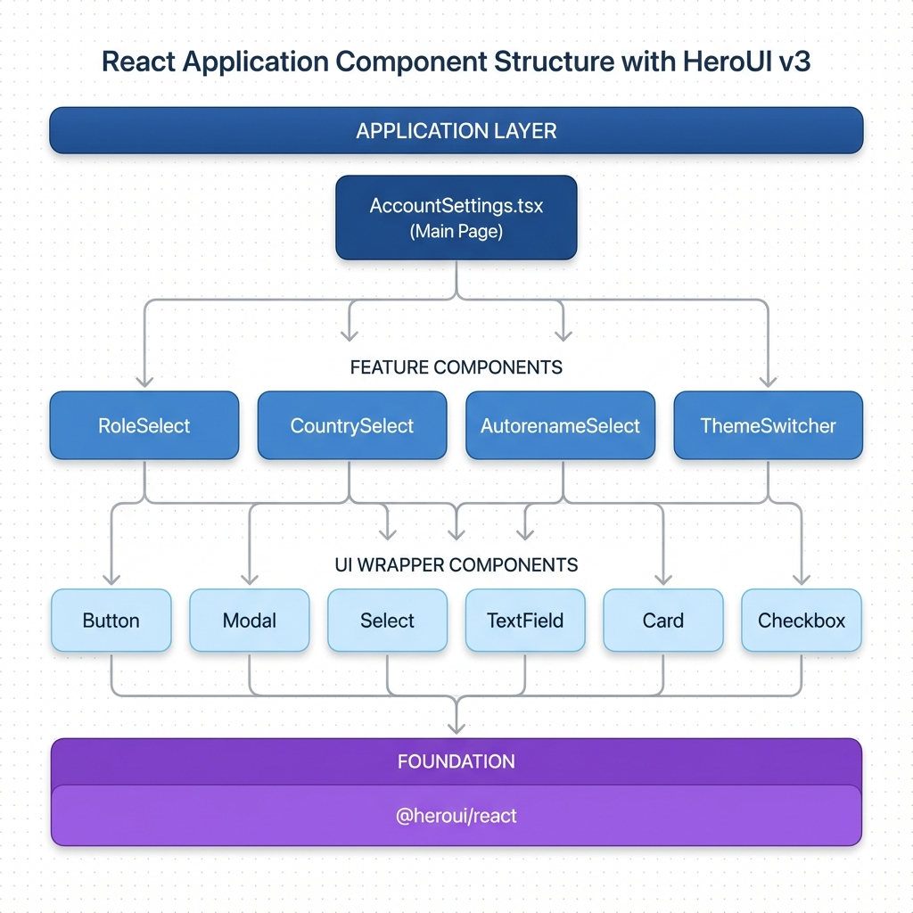

# Company Account Settings - Splento Platform v3

Modern, accessible company account management interface built with **HeroUI v3** and React.


---

## 🎯 Features

- ✅ **HeroUI v3 Beta** - Built with the latest HeroUI component library
- ✅ **TypeScript** - Full type safety across the application
- ✅ **Tailwind CSS v4** - Modern utility-first styling
- ✅ **Light/Dark Themes** - Complete theme system with instant switching
- ✅ **Fully Accessible** - WCAG AA compliant, keyboard navigation, screen reader support
- ✅ **Responsive Design** - Mobile-first, works on all devices
- ✅ **Semantic Variants** - Intent-driven button and component variants
- ✅ **Custom Theme System** - 70+ CSS variables for complete customization

---

## 🚀 Quick Start

### Prerequisites

- Node.js 18+ or 20+
- npm or yarn

### Installation

```bash
# Install dependencies
npm install

# Start development server
npm run dev

# Build for production
npm run build

# Preview production build
npm run preview

# Run linter
npm run lint
```

### Development Server

```bash
npm run dev
```

Visit [http://localhost:5173](http://localhost:5173)

---

## 📁 Project Structure

```
company-account-settings/
├── src/
│   ├── app/
│   │   └── admin/
│   │       └── AccountSettings.tsx    # Main page component
│   ├── components/
│   │   ├── ui/                        # HeroUI wrapper components
│   │   │   ├── button.tsx             # Button component
│   │   │   ├── modal.tsx              # Modal component
│   │   │   ├── select.tsx             # Select component
│   │   │   └── ...                    # Other UI components
│   │   ├── admin/                     # Feature components
│   │   │   ├── RoleSelect.tsx
│   │   │   ├── CountrySelect.tsx
│   │   │   └── ...
│   │   └── ThemeSwitcher.tsx          # Theme toggle component
│   ├── types/
│   │   └── index.ts                   # TypeScript type definitions
│   ├── index.css                      # Global styles & theme
│   └── main.tsx                       # Application entry point
├── index.html
├── vite.config.ts
├── tsconfig.json
├── package.json
├── README.md
├── THEMING.md                        # Theme customization guide
└── CONTRIBUTING.md                   # Development guidelines
```

---

## 🎨 HeroUI v3 Usage

### Component Pattern

All UI components follow a consistent **dot notation** export pattern:

```tsx
import { Button } from '@/components/ui/button';
import { Modal } from '@/components/ui/modal';

function Example() {
  return (
    <Modal>
      <Modal.Container>
        <Modal.Dialog>
          <Modal.Header>
            <Modal.Title>Example</Modal.Title>
            <Modal.CloseTrigger />
          </Modal.Header>
          <Modal.Body>
            Content here
          </Modal.Body>
          <Modal.Footer>
            <Button variant="primary">Save</Button>
          </Modal.Footer>
        </Modal.Dialog>
      </Modal.Container>
    </Modal>
  );
}
```

### Semantic Variants

Use **semantic intent** instead of visual styles:

```tsx
// ✅ Good - Semantic intent
<Button variant="primary">Save Changes</Button>
<Button variant="danger">Delete Account</Button>
<Button variant="secondary">Cancel</Button>

// ❌ Avoid - Visual description
<Button className="bg-blue-500">Save</Button>
```

**Available Variants:**

- `primary` - Main actions (Save, Submit, Confirm)
- `secondary` - Secondary actions (Cancel, Back)
- `tertiary` - Subtle actions (Skip, Maybe Later)
- `danger` - Destructive actions (Delete, Remove)
- `ghost` - Minimal emphasis

### Type Safety

All components are fully typed:

```tsx
import type { ButtonProps } from '@/components/ui/button';

// Type alias pattern (not interface)
export type CustomButtonProps = ButtonProps & {
  customProp?: string;
};
```

### Accessibility

All components include proper accessibility:

```tsx
// Icon-only buttons MUST have aria-label
<Button variant="ghost" aria-label="Delete manager">
  <Icon icon="solar:trash-bin-minimalistic-bold" />
</Button>

// Form fields automatically get labels
<TextField>
  <Label>Email Address</Label>
  <Input type="email" />
</TextField>
```

---

## 🎨 Theming

### Quick Theme Switch

```tsx
import { ThemeSwitcher } from '@/components/ThemeSwitcher';

<ThemeSwitcher /> // Automatically toggles light/dark
```

### Custom Theme Colors

Edit `src/index.css`:

```css
@layer theme {
  :root, [data-theme="light"] {
    --accent: oklch(0.550 0.220 262);  /* Your brand color */
    --accent-foreground: oklch(0.99 0 0);
  }
}
```

**See [THEMING.md](./THEMING.md) for complete theming guide.**

---

## 🧩 Component Architecture

### Wrapper Components



UI components are lightweight wrappers around HeroUI:

```tsx
// src/components/ui/button.tsx
import { Button as HButton, type ButtonProps as HButtonProps } from "@heroui/react";

export type ButtonProps = HButtonProps;

export function Button(props: ButtonProps) {
  return <HButton {...props} />;
}
```

**Benefits:**

- ✅ Consistent import paths
- ✅ Easy to customize globally
- ✅ Type safety maintained
- ✅ Can add project-specific props later

### Feature Components

Domain-specific components in `components/admin/`:

```tsx
// src/components/admin/RoleSelect.tsx
export function RoleSelect({ role, onChange }: RoleSelectProps) {
  return (
    <Select selectedKey={role} onSelectionChange={onChange}>
      <Select.Trigger>
        <Select.Value />
        <Select.Indicator />
      </Select.Trigger>
      <Select.Popover>
        <ListBox>
          <ListBox.Item id="Admin">Admin</ListBox.Item>
          <ListBox.Item id="Edit">Edit</ListBox.Item>
          <ListBox.Item id="Read Only">Read Only</ListBox.Item>
        </ListBox>
      </Select.Popover>
    </Select>
  );
}
```

---

## 🧪 Testing

### Build Verification

```bash
npm run build
# ✓ TypeScript compilation
# ✓ Vite optimization
# ✓ Bundle created
```

### Lint Check

```bash
npm run lint
# ✓ ESLint passes
# ✓ TypeScript checks
# ✓ No errors
```

### Manual Testing Checklist

- [ ] All buttons clickable
- [ ] Modals open/close correctly
- [ ] Forms validate properly
- [ ] Theme switcher works
- [ ] Keyboard navigation (Tab, Enter, Escape)
- [ ] Responsive on mobile/tablet/desktop
- [ ] Screen reader compatible

---

## 📦 Technologies

| Technology | Version | Purpose |
|------------|---------|---------|
| [React](https://react.dev) | 19.2.0 | UI framework |
| [HeroUI v3](https://v3.heroui.com) | 3.0.0-beta.2 | Component library |
| [TypeScript](https://typescriptlang.org) | 5.9 | Type safety |
| [Tailwind CSS](https://tailwindcss.com) | 4.1 | Styling |
| [Vite](https://vite.dev) | 7.2 | Build tool |
| [Iconify](https://iconify.design) | 6.0 | Icons |

---

## 🎯 HeroUI v3 Principles

This project follows the **10 Core Principles** of HeroUI v3:

1. ✅ **Semantic Intent Over Visual Style** - Use `variant="primary"` not `className="blue"`
2. ✅ **Accessibility as Foundation** - All components keyboard accessible, screen reader compatible
3. ✅ **Composition Over Configuration** - Build complex UIs from small components
4. ✅ **Progressive Disclosure** - Simple by default, powerful when needed
5. ✅ **Predictable Behavior** - Consistent API across components
6. ✅ **Type Safety First** - Full TypeScript support, no `any` types
7. ✅ **Separation of Styles and Logic** - Styles in CSS layers, logic in components
8. ✅ **Developer Experience Excellence** - Clear patterns, good docs
9. ✅ **Complete Customization** - 70+ theme variables
10. ✅ **Open and Extensible** - Dot notation allows easy composition

**Grade: A (93/100)** based on HeroUI v3 code review.

---

## 🤝 Contributing

See [CONTRIBUTING.md](./CONTRIBUTING.md) for development guidelines.

**Quick Guidelines:**

- Use semantic variants for buttons
- Follow dot notation pattern for components
- Add aria-labels to icon-only buttons
- Use type aliases (not interfaces) for props
- Test keyboard navigation
- Document theme variables

---

## 📖 Additional Documentation

- [THEMING.md](./THEMING.md) - Complete theming guide
- [CONTRIBUTING.md](./CONTRIBUTING.md) - Development guidelines
- [HeroUI v3 Docs](https://v3.heroui.com) - Official HeroUI documentation
- [HEROUI_V3_CODE_REVIEW.md](../HEROUI_V3_CODE_REVIEW.md) - Code review findings

---

## 📝 License

MIT License - See LICENSE file for details

---

## 🆘 Support

**Issues?**

- Check [HeroUI v3 Documentation](https://v3.heroui.com)
- Review [THEMING.md](./THEMING.md) for styling issues
- Check [CONTRIBUTING.md](./CONTRIBUTING.md) for development questions

**Common Issues:**

- **Build fails:** Check Node.js version (18+ required)
- **Types error:** Run `npm install` to refresh types
- **Styles not applying:** Check theme is set in `index.html`
- **Components not found:** Verify import paths

---

Made with ❤️ using HeroUI v3
